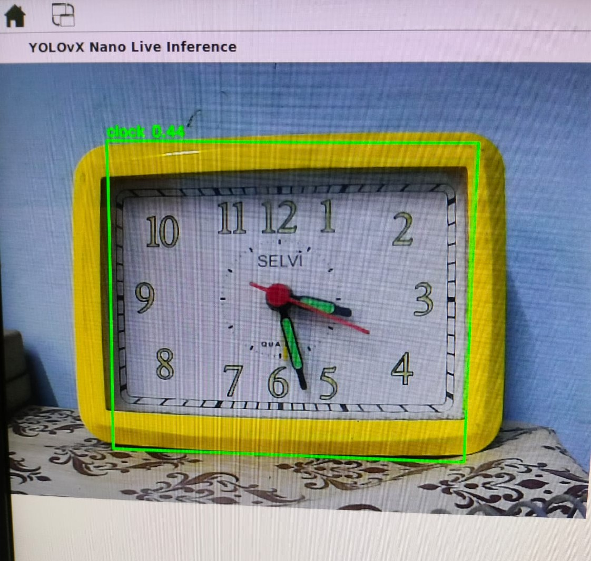
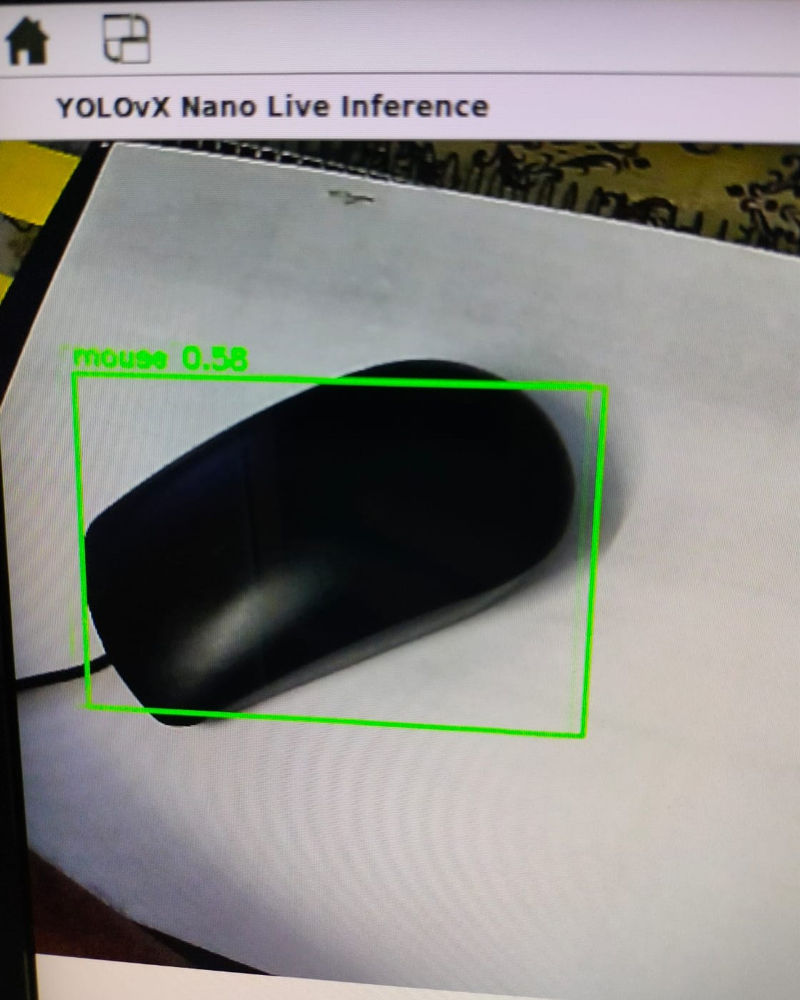

# YOLOX-Nano Inference on Kria KV260

YOLOX-Nano running in real time on the AMD Xilinx Kria KV260 using a compiled Vitis AI C++ application.

The model takes the live camera feed from `/dev/video0`, performs object detection on the KV260, and displays the results on the monitor through the HDMI/DisplayPort output.

## Detection Results

### 1. Teddy Bear

  

---

### 2. Clock

  

---

### 3. Computer Mouse

  

---

## Results

| Object          | Detection    | Confidence |
| --------------- | ------------ | ---------: |
| Toy figure      | `teddy bear` |        60% |
| clock           | `clock`      |        44% |
| Computer mouse  | `mouse`      |        58% |

These tests confirm that the YOLOX-Nano model is running correctly on the KV260, with bounding boxes and class labels being generated from the live camera stream.

### Setup

* **Board:** AMD Xilinx Kria KV260
* **Model:** YOLOX-Nano
* **Inference:** Vitis AI C++
* **Camera:** `/dev/video0`
* **Display:** HDMI/DisplayPort
* **Output:** Live object detection with bounding boxes and labels
